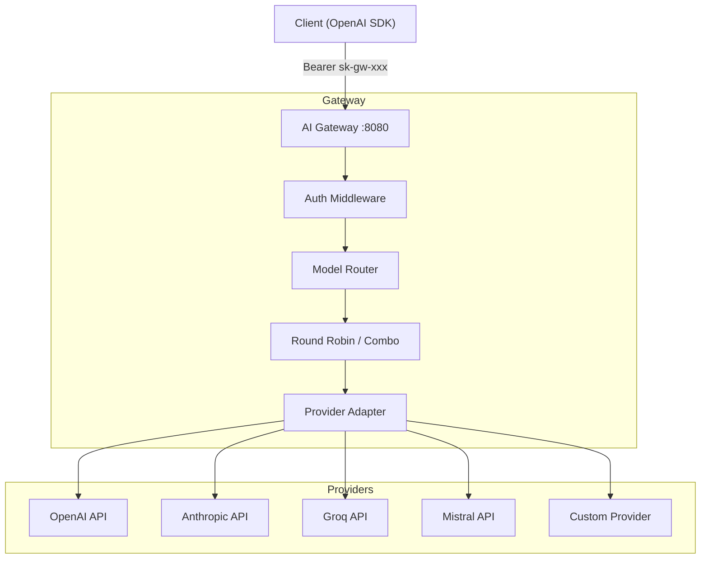
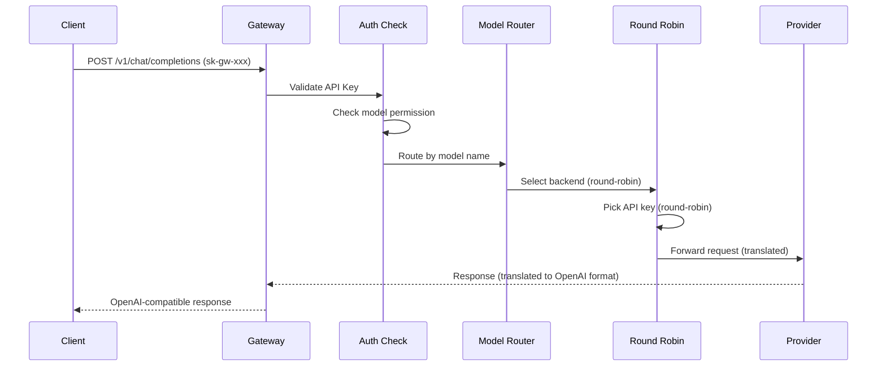

# AI Gateway — Implementation Plan

Membangun AI Gateway (proxy) yang ringan dan performa tinggi menggunakan **Go**, kompatibel dengan API OpenAI, mendukung multi-provider, round-robin, dan manajemen API key untuk user eksternal.

## Ringkasan Fitur

| # | Fitur | Deskripsi |
|---|-------|-----------|
| 1 | Multi API Key per Provider | Satu provider bisa punya banyak API key, dirotasi otomatis |
| 2 | Built-in Providers | OpenAI, Anthropic, Groq, Mistral AI |
| 3 | Custom Provider | Tambah provider custom (OpenAI-compatible endpoint) |
| 4 | Round-Robin Model | Request didistribusi ke beberapa model secara bergiliran |
| 5 | Round-Robin API Key | API key provider dirotasi per-request |
| 6 | Concurrency Control | Limit concurrent requests per provider/model bisa dikonfigurasi |
| 7 | Performa Hemat | Target idle < 30MB RAM, binary tunggal |
| 8 | Linux Compatible | Build untuk Ubuntu/Linux, single binary tanpa dependency |
| 9 | Combo Model | Gabungan beberapa model (fallback chain / load-balance) |
| 10 | User API Key | Generate API key untuk user luar, dengan allow-list model/combo |

---

## Arsitektur



### Alur Request



---

## Tech Stack

| Komponen | Pilihan | Alasan |
|----------|---------|--------|
| Language | Go 1.22+ | Performa tinggi, RAM rendah, single binary |
| HTTP Server | `net/http` (stdlib) | Zero dependency, production-ready |
| Router | `http.ServeMux` (Go 1.22 pattern) | Built-in pattern routing, zero alloc |
| Config | YAML (`gopkg.in/yaml.v3`) | Human-friendly config format |
| JSON | `encoding/json` (stdlib) | Standar, cukup cepat |
| Logging | `log/slog` (stdlib) | Structured logging, built-in Go 1.21+ |
| Concurrency | `sync`, `semaphore` | Built-in, efisien |
| UUID | `google/uuid` | Untuk generate API key |

> [!TIP]
> Dengan hanya 2 dependency eksternal (`yaml.v3` dan `google/uuid`), binary tetap kecil dan RAM usage sangat rendah.

---

## Struktur Project

```
aigateway/
├── main.go                  # Entry point, load config, start server
├── go.mod
├── go.sum
├── config.yaml              # Konfigurasi utama
│
├── config/
│   └── config.go            # Struct config & loader
│
├── server/
│   └── server.go            # HTTP server setup & middleware
│
├── auth/
│   └── auth.go              # API key validation & permission check
│
├── router/
│   └── router.go            # Model routing, combo resolution
│
├── balancer/
│   └── roundrobin.go        # Round-robin untuk model & API key
│
├── provider/
│   ├── provider.go          # Provider interface
│   ├── openai.go            # OpenAI adapter
│   ├── anthropic.go         # Anthropic adapter (translate format)
│   ├── groq.go              # Groq adapter (OpenAI-compatible)
│   ├── mistral.go           # Mistral adapter (OpenAI-compatible)
│   └── custom.go            # Custom provider (OpenAI-compatible)
│
├── proxy/
│   └── handler.go           # Main proxy handler, streaming support
│
├── middleware/
│   ├── ratelimit.go         # Concurrency limiter (semaphore)
│   └── logging.go           # Request/response logging
│
├── models/
│   └── openai.go            # OpenAI request/response structs
│
└── admin/
    └── admin.go             # Admin API (manage keys, reload config)
```

---

## Konfigurasi (`config.yaml`)

```yaml
server:
  host: "0.0.0.0"
  port: 8080
  admin_port: 8081          # Admin API (opsional, bisa same port)
  admin_secret: "super-secret-admin-key"

# Global concurrency limit
concurrency:
  max_concurrent: 100       # Max total concurrent requests
  per_provider: 20          # Max concurrent per provider
  per_model: 10             # Max concurrent per model

# ========== PROVIDERS ==========
providers:
  - name: "openai"
    type: "openai"                       # built-in type
    base_url: "https://api.openai.com/v1"
    api_keys:
      - "sk-key1-xxxx"
      - "sk-key2-xxxx"
      - "sk-key3-xxxx"
    models:
      - "gpt-4o"
      - "gpt-4o-mini"
      - "gpt-4.1"

  - name: "anthropic"
    type: "anthropic"                    # built-in, translate format
    base_url: "https://api.anthropic.com"
    api_keys:
      - "sk-ant-key1"
      - "sk-ant-key2"
    models:
      - "claude-sonnet-4-20250514"
      - "claude-haiku-4-20250514"

  - name: "groq"
    type: "groq"                         # OpenAI-compatible
    base_url: "https://api.groq.com/openai/v1"
    api_keys:
      - "gsk-key1"
      - "gsk-key2"
    models:
      - "llama-3.3-70b-versatile"
      - "mixtral-8x7b-32768"

  - name: "mistral"
    type: "mistral"                      # OpenAI-compatible
    base_url: "https://api.mistral.ai/v1"
    api_keys:
      - "mistral-key1"
    models:
      - "mistral-large-latest"
      - "mistral-small-latest"

  - name: "local-llm"
    type: "custom"                       # Custom OpenAI-compatible
    base_url: "http://localhost:11434/v1"
    api_keys:
      - "ollama"
    models:
      - "llama3"
      - "codestral"

# ========== MODEL ALIASES & COMBOS ==========
models:
  # Simple alias — maps to single provider model
  - name: "gpt-4o"
    provider: "openai"
    model: "gpt-4o"

  # Round-robin model — distribusi ke beberapa backend
  - name: "fast-model"
    strategy: "round-robin"
    backends:
      - provider: "groq"
        model: "llama-3.3-70b-versatile"
      - provider: "mistral"
        model: "mistral-small-latest"

  # Combo model — fallback chain (coba pertama, kalau gagal ke berikutnya)
  - name: "smart-combo"
    strategy: "fallback"
    backends:
      - provider: "anthropic"
        model: "claude-sonnet-4-20250514"
      - provider: "openai"
        model: "gpt-4o"
      - provider: "groq"
        model: "llama-3.3-70b-versatile"

  # Combo model — round-robin
  - name: "budget-mix"
    strategy: "round-robin"
    backends:
      - provider: "groq"
        model: "llama-3.3-70b-versatile"
      - provider: "mistral"
        model: "mistral-small-latest"
      - provider: "openai"
        model: "gpt-4o-mini"

# ========== USER API KEYS ==========
api_keys:
  - key: "sk-gw-user1-xxxxxxxxxxxxx"
    name: "User 1 - Full Access"
    allowed_models:
      - "*"                              # Semua model
    rate_limit: 60                       # req/menit (0 = unlimited)

  - key: "sk-gw-user2-xxxxxxxxxxxxx"
    name: "User 2 - Budget Only"
    allowed_models:
      - "budget-mix"
      - "fast-model"
    rate_limit: 30

  - key: "sk-gw-test-xxxxxxxxxxxxx"
    name: "Test Key"
    allowed_models:
      - "gpt-4o-mini"
    rate_limit: 10
```

---

## Detail Implementasi per Komponen

### 1. Config Loader (`config/config.go`)

- Parse `config.yaml` ke Go structs
- Validasi: pastikan semua provider punya minimal 1 API key & 1 model
- Validasi: pastikan semua model reference valid provider
- Support reload config via admin API (hot reload tanpa restart)

---

### 2. Provider Interface (`provider/provider.go`)

```go
type Provider interface {
    Name() string
    ChatCompletion(ctx context.Context, req *ChatRequest) (*ChatResponse, error)
    ChatCompletionStream(ctx context.Context, req *ChatRequest) (<-chan StreamChunk, error)
    SupportsModel(model string) bool
}
```

#### Provider Implementations:

| File | Provider | Metode |
|------|----------|--------|
| `openai.go` | OpenAI | Forward langsung (native format) |
| `anthropic.go` | Anthropic | **Translate** OpenAI format → Anthropic Messages API → translate response balik |
| `groq.go` | Groq | Forward langsung (OpenAI-compatible) |
| `mistral.go` | Mistral | Forward langsung (OpenAI-compatible) |
| `custom.go` | Custom | Forward langsung (OpenAI-compatible, configurable base_url) |

> [!IMPORTANT]
> **Anthropic Translation**: Anthropic menggunakan format berbeda (system message terpisah, role `assistant` dan `user`, response format berbeda). Adapter ini akan mentranslasi:
> - OpenAI `messages[{role: "system"}]` → Anthropic `system` field
> - OpenAI `stream: true` → Anthropic SSE stream
> - Anthropic `content[{type: "text"}]` → OpenAI `choices[{message}]`

---

### 3. Round-Robin Balancer (`balancer/roundrobin.go`)

```go
type RoundRobin struct {
    items   []string
    counter atomic.Uint64
}

func (rr *RoundRobin) Next() string {
    n := rr.counter.Add(1)
    return rr.items[n % uint64(len(rr.items))]
}
```

- **API Key Round-Robin**: Setiap provider punya `RoundRobin` untuk API keys
- **Model Round-Robin**: Setiap combo model `round-robin` punya `RoundRobin` untuk backends
- Lock-free menggunakan `atomic.Uint64` — zero contention

---

### 4. Concurrency Control (`middleware/ratelimit.go`)

Menggunakan **semaphore pattern** (`golang.org/x/sync/semaphore` atau custom channel-based):

```go
type ConcurrencyLimiter struct {
    global      chan struct{}  // buffered channel as semaphore
    perProvider map[string]chan struct{}
    perModel    map[string]chan struct{}
}
```

- Acquire semaphore sebelum forward request
- Release setelah response selesai (termasuk streaming)
- Jika semaphore full → return `429 Too Many Requests`

---

### 5. Auth & API Key Management (`auth/auth.go`)

- Extract `Bearer` token dari `Authorization` header
- Lookup key di map (O(1) lookup)
- Check apakah requested model ada di `allowed_models`
- Wildcard `"*"` = semua model diperbolehkan
- Simple rate limiting per key (sliding window counter)

---

### 6. Proxy Handler (`proxy/handler.go`)

Endpoint yang diimplementasikan:

| Endpoint | Deskripsi |
|----------|-----------|
| `POST /v1/chat/completions` | Chat completion (streaming & non-streaming) |
| `GET /v1/models` | List available models (filtered by user permission) |
| `GET /health` | Health check |

**Streaming Support**:
- Detect `"stream": true` dalam request body
- Forward SSE (Server-Sent Events) dari upstream
- Translate streaming format jika provider beda (Anthropic)
- Flush setiap chunk ke client secara real-time

---

### 7. Admin API (`admin/admin.go`)

| Endpoint | Method | Deskripsi |
|----------|--------|-----------|
| `/admin/keys` | GET | List semua API keys |
| `/admin/keys` | POST | Generate API key baru |
| `/admin/keys/{id}` | DELETE | Hapus API key |
| `/admin/config/reload` | POST | Hot reload config |
| `/admin/stats` | GET | Statistik (total requests, per model, dll) |

- Dilindungi oleh `admin_secret` header
- Generate key format: `sk-gw-{random-uuid}`

---

## Optimisasi Performa (Target < 30MB RAM idle)

| Strategi | Detail |
|----------|--------|
| Zero framework | Hanya stdlib `net/http` + 2 lib kecil |
| Streaming proxy | Tidak buffer seluruh response body di memory |
| `io.Copy` passthrough | Body langsung di-pipe ke upstream, minimal alloc |
| `sync.Pool` | Reuse buffer untuk HTTP request/response |
| No ORM/database | Config di-load ke memory dari YAML file |
| Single binary | Go static compilation, no runtime deps |
| Minimal goroutine | Hanya goroutine per-request (standar `net/http`) |

> [!NOTE]
> Go `net/http` server idle biasanya hanya ~5-10MB. Dengan config kecil dan tanpa database, target 30MB sangat achievable bahkan di bawah load moderat.

---

## Proposed Changes

### Core Infrastructure

#### [NEW] [go.mod](file:///c:/laragon/laragon/golang/aigateway/go.mod)
Go module definition dengan minimal dependencies (`yaml.v3`, `google/uuid`).

#### [NEW] [main.go](file:///c:/laragon/laragon/golang/aigateway/main.go)
Entry point: load config → init providers → init balancers → start HTTP server.

#### [NEW] [config.yaml](file:///c:/laragon/laragon/golang/aigateway/config.yaml)
Contoh konfigurasi lengkap dengan semua fitur.

---

### Config Package

#### [NEW] [config/config.go](file:///c:/laragon/laragon/golang/aigateway/config/config.go)
Struct definitions dan YAML config loader dengan validasi.

---

### Provider Package

#### [NEW] [provider/provider.go](file:///c:/laragon/laragon/golang/aigateway/provider/provider.go)
Provider interface dan registry.

#### [NEW] [provider/openai.go](file:///c:/laragon/laragon/golang/aigateway/provider/openai.go)
OpenAI adapter — forward langsung.

#### [NEW] [provider/anthropic.go](file:///c:/laragon/laragon/golang/aigateway/provider/anthropic.go)
Anthropic adapter — full request/response translation termasuk streaming.

#### [NEW] [provider/groq.go](file:///c:/laragon/laragon/golang/aigateway/provider/groq.go)
Groq adapter — OpenAI-compatible forward.

#### [NEW] [provider/mistral.go](file:///c:/laragon/laragon/golang/aigateway/provider/mistral.go)
Mistral adapter — OpenAI-compatible forward.

#### [NEW] [provider/custom.go](file:///c:/laragon/laragon/golang/aigateway/provider/custom.go)
Custom provider adapter — generic OpenAI-compatible forward.

---

### Models Package

#### [NEW] [models/openai.go](file:///c:/laragon/laragon/golang/aigateway/models/openai.go)
OpenAI API request/response struct definitions (ChatRequest, ChatResponse, StreamChunk, dll).

#### [NEW] [models/anthropic.go](file:///c:/laragon/laragon/golang/aigateway/models/anthropic.go)
Anthropic API request/response struct definitions.

---

### Balancer Package

#### [NEW] [balancer/roundrobin.go](file:///c:/laragon/laragon/golang/aigateway/balancer/roundrobin.go)
Lock-free round-robin implementation menggunakan `atomic.Uint64`.

---

### Router Package

#### [NEW] [router/router.go](file:///c:/laragon/laragon/golang/aigateway/router/router.go)
Model routing logic: resolve model name → provider + backend model. Handle combo/fallback.

---

### Auth Package

#### [NEW] [auth/auth.go](file:///c:/laragon/laragon/golang/aigateway/auth/auth.go)
API key validation, permission checking, rate limiting.

---

### Server & Middleware

#### [NEW] [server/server.go](file:///c:/laragon/laragon/golang/aigateway/server/server.go)
HTTP server setup, route registration, middleware chain.

#### [NEW] [middleware/ratelimit.go](file:///c:/laragon/laragon/golang/aigateway/middleware/ratelimit.go)
Semaphore-based concurrency limiter (global, per-provider, per-model).

#### [NEW] [middleware/logging.go](file:///c:/laragon/laragon/golang/aigateway/middleware/logging.go)
Structured request logging menggunakan `slog`.

---

### Proxy Handler

#### [NEW] [proxy/handler.go](file:///c:/laragon/laragon/golang/aigateway/proxy/handler.go)
Main request handler: `/v1/chat/completions`, `/v1/models`, `/health`. Handles streaming dan non-streaming.

---

### Admin API

#### [NEW] [admin/admin.go](file:///c:/laragon/laragon/golang/aigateway/admin/admin.go)
Admin endpoints: key management, config reload, stats.

---

## Verification Plan

### Build & Test
```bash
# Build
go build -o aigateway .

# Check binary size
ls -lh aigateway

# Check idle memory usage
./aigateway &
sleep 2
ps aux | grep aigateway  # should show < 30MB RSS

# Test health endpoint
curl http://localhost:8080/health

# Test models list
curl -H "Authorization: Bearer sk-gw-user1-xxx" http://localhost:8080/v1/models

# Test chat completion
curl -X POST http://localhost:8080/v1/chat/completions \
  -H "Authorization: Bearer sk-gw-user1-xxx" \
  -H "Content-Type: application/json" \
  -d '{"model": "budget-mix", "messages": [{"role": "user", "content": "Hello!"}]}'

# Test streaming
curl -X POST http://localhost:8080/v1/chat/completions \
  -H "Authorization: Bearer sk-gw-user1-xxx" \
  -H "Content-Type: application/json" \
  -d '{"model": "gpt-4o", "messages": [{"role": "user", "content": "Hello!"}], "stream": true}'

# Test admin API
curl -H "X-Admin-Secret: super-secret-admin-key" http://localhost:8081/admin/keys
curl -X POST -H "X-Admin-Secret: super-secret-admin-key" \
  -d '{"name": "New User", "allowed_models": ["gpt-4o"]}' \
  http://localhost:8081/admin/keys
```

### Manual Verification
- Test dengan OpenAI Python SDK pointing ke gateway
- Verifikasi round-robin bekerja (lihat log distribusi request)
- Test concurrency limit (send banyak request concurrent)
- Test combo fallback (matikan satu provider, harus fallback)
- Build untuk Linux: `GOOS=linux GOARCH=amd64 go build -o aigateway`
